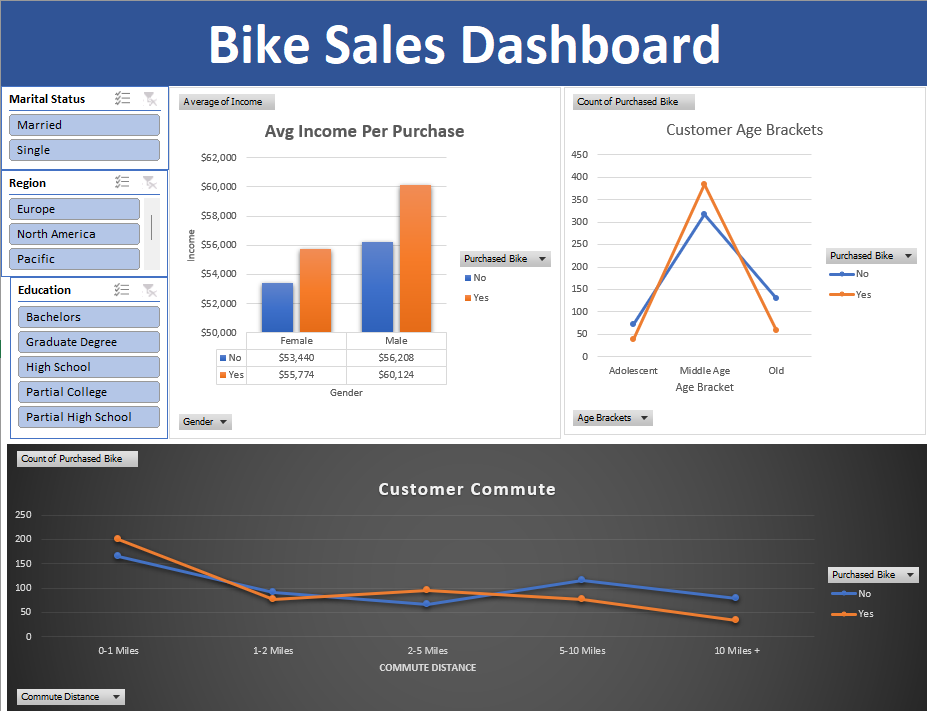

# 🚲 Bike Sales Dashboard — Excel
An interactive Excel dashboard analysing bike purchase behaviour across demographics.
## Key Insights
- Income vs Purchase Likelihood by Gender
- Purchase trends across Age Brackets (Adolescent, Middle Age, Old)
- Commute Distance impact on bike purchase decisions
## Tools Used
- Microsoft Excel
- Pivot Tables
- Slicers
- Interactive Dashboard Design
## Dashboard Preview

